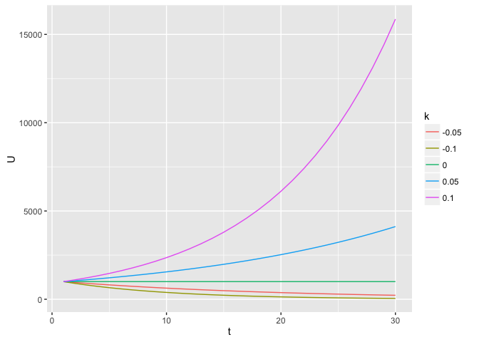

# Viral Coefficient Investigation
Johan Jordaan  
16 August 2016  


## Model
The model is very simple :  $U_{t+1} = U_t * (1+k)$
Here $k$ is the *Viral Coeficient*.  

## Assumptions
This study is based on the following two assumptions:

* The Viral Coeficient $k$ is constant. 
* All new users are aquired based on the strength of the Viral Coeficient.

## Exploring the model

```r
calc <- function(start, factor, steps) {
  calc_next <- function(a,b) { return(a*factor); }   
  retVal <- Reduce(calc_next,rep(start,steps),accumulate=TRUE);
  return(retVal);
}

start <- 1000
steps <- 30
m <- cbind(t=rep(seq(1,steps),3),"1.1"=calc(start,1.1,steps),"1.0"=calc(start,0.9,steps),"0.9"=calc(start,1,steps))

tm <- gather(data.frame(m),"k","U",2:4)
```


```r
p <- ggplot(tm, aes(x=t,y=U,color=k)) + geom_line()
print(p)
```

<!-- -->


